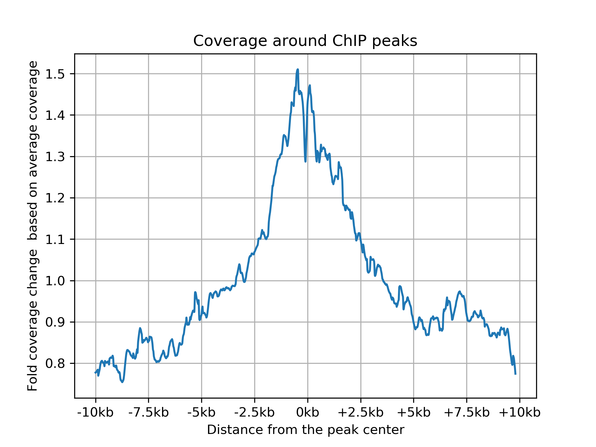

# HiChIP Data QC 
## Description
This is the description of the scripts that will perform QC steps in HiChIP data. This script is run after running the Omni-C QC script. 

## Requirements

This script depends on the following tools in addition to the tools required for the alignment QC:

- [pysam](https://pysam.readthedocs.io/en/latest/)
- [bedtools](https://bedtools.readthedocs.io/en/latest/index.html)
- [deeptools](https://deeptools.readthedocs.io/en/develop/)

## Running
After you generate the BAM from Omni-C, you can run HiChIP QC script as:

```
./hichip_qc.bash reference.fasta alignment.bam chipseq_peaks.bed output_prefix
```

`chipseq_peaks.bed` is a list of peaks called using ChipSeq data. We use this data from Encode data portal. 

## Output
This will print output as follows: 

```
Total read pairs:	28786600
Total read pairs in peaks:	505404(1.76%)
Total read pairs in 500 bp around peaks:	2640644(9.17%)
Total read pairs in 1000 bp around peaks:	4486930(15.59%)
Total read pairs in 2000 bp around peaks:	7515833(26.11%)
Total read pairs in 5000 bp around peaks:	12418085(43.14%)
```

Along with these statistics, the QC pipeline will output two plots. The first one is for the coverage enrichent around ChIP peaks. It would look as follows



