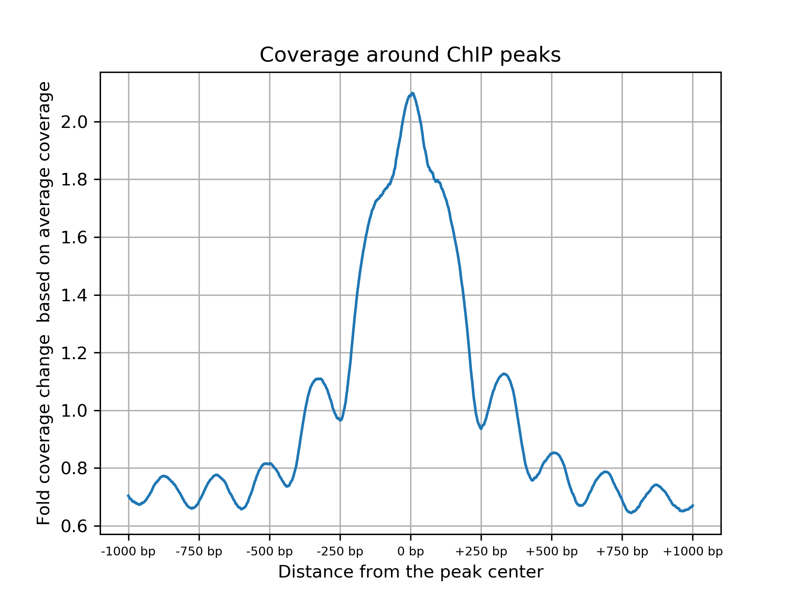

# HiChIP Data QC 
## Description
This is the description of the scripts that will perform QC steps in HiChIP data.

## Requirements

This script depends on the following tools in addition to the tools required for the alignment QC:

- [pysam](https://pysam.readthedocs.io/en/latest/)
- [bedtools](https://bedtools.readthedocs.io/en/latest/index.html)
- [deeptools](https://deeptools.readthedocs.io/en/develop/)
- [matplotlib](https://matplotlib.org/)
- [pandas](https://pandas.pydata.org/pandas-docs/stable/dsintro.html)

If you have already created conda environment using `create.sh` script in the `conda` folder, you have all these dependencies!

## Running


```
Usage: 
./hichip_qc.bash <reference_fasta> <read1_fastq> <reaf2_fastq>  <chipseq_peaks>  <output_prefix> <num_cores>

Example:
./hichip_qc.bash reference.fasta read1.fastq.gz reads2.fastq.gz chipseq_peaks.bed NA12878 8
```

`chipseq_peaks.bed` is a list of peaks called using ChipSeq data. We use this data from Encode data portal. 

## Output
This will print output as follows: 

```
Total ChIP peaks                                           38,947
Mean ChIP peak size                                        305 bp
Median ChIP peak size                                      305 bp
Total reads in blacklist regions                           74,811      0.04%
Total reads  in peaks                                      14,318,817  6.79%
Total reads in 500 bp around peaks                         24,251,334  11.5%
Total reads in 1000 bp around peaks                        31,391,169  14.88%
Total reads in 2000 bp around peaks                        43,795,466  20.76%
Observed/Expected ratio for reads in peaks                 17.6
Observed/Expected ratio for reads in 500bp around          11.31
Observed/Expected ratio for reads in 1000bp around  peaks  9.04
Observed/Expected ratio for reads in 2000bp around  peaks  7.14
```

Along with these statistics, the QC pipeline will output two plots. The first one is for the coverage enrichent around ChIP peaks. It would look as follows




The pipeline also generates bigwig file for coverage tracks inferred from the BAM file in the output directory. 
