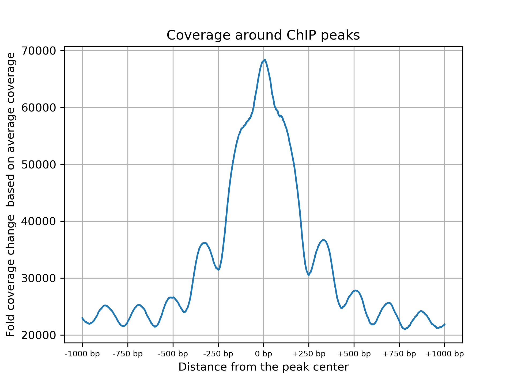

# HiChIP Data QC 
## Description
This is the description of the scripts that will perform QC steps in HiChIP data.

## Requirements

This script depends on the following tools in addition to the tools required for the alignment QC:

- [pysam](https://pysam.readthedocs.io/en/latest/)
- [bedtools](https://bedtools.readthedocs.io/en/latest/index.html)
- [deeptools](https://deeptools.readthedocs.io/en/develop/)
- [matplotlib](https://matplotlib.org/)
- [pandas](https://pandas.pydata.org/pandas-docs/stable/dsintro.html)

If you have already created conda environment using `create.sh` script in the `conda` folder, you have all these dependencies!

## Running


```
Usage: 
./hichip_qc.bash <reference_fasta> <read1_fastq> <reaf2_fastq>  <chipseq_peaks>  <output_prefix> <num_cores>

Example:
./hichip_qc.bash reference.fasta read1.fastq.gz reads2.fastq.gz chipseq_peaks.bed NA12878 8
```

`chipseq_peaks.bed` is a list of peaks called using ChipSeq data. We use this data from Encode data portal. 

## Output
This will print output as follows: 

```
Mapping Quality Threshold         : 40
Read1                             : 7436
Read2                             : 8254
Mapped pairs                      : 6852
PCR dupe pairs                    : 3
Mapped nondupe pairs              : 6849
Valid Pairs (cis>1000bp + trans)  : 2991
Mapped nondupe pairs cis          : 5935
Mapped nondupe pairs cis <=1000bp : 3858
Mapped nondupe pairs cis >1000bp  : 2077
Mapped nondupe pairs cis >10000bp : 1664
Mapped nondupe trans pairs        : 914
Expected unique pairs at 300M sequencing:  19296365.7
Total ChIP peaks:       45023
Mean ChIP peak size:    168 bp
Median ChIP peak size:  204 bp
Total read pairs in 500 bp around peaks:        211(1.68%)
Total read pairs in 1000 bp around peaks:       353(2.8%)
Total read pairs in 2000 bp around peaks:       548(4.35%)
Total read pairs in 5000 bp around peaks:       1,144(9.08%)
```

Along with these statistics, the QC pipeline will output two plots. The first one is for the coverage enrichent around ChIP peaks. It would look as follows




It will also output ChIP fingerprint plot as follows:


The pipeline also generates bigwig file for coverage tracks inferred from the BAM file in the output directory. 
